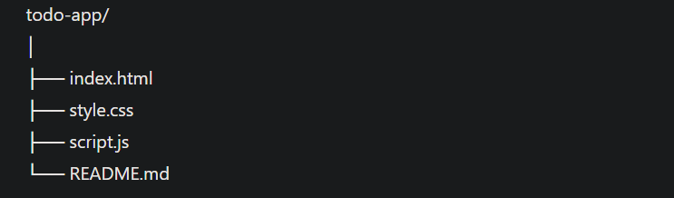

# 📝 To-Do List Web App

A modern and responsive To-Do List Web Application built using **HTML, CSS, and Vanilla JavaScript**.

This project demonstrates core front-end concepts like DOM manipulation, event handling, and dynamic UI updates without using any frameworks.

---

## 🚀 Features

- ✅ Add new tasks
- ✅ Mark tasks as completed
- ✅ Delete tasks
- ✅ Instant UI updates (No page reload)
- ✅ Smooth and modern hover effects
- ✅ Responsive and clean UI design

---

## 🛠 Technologies Used

- HTML5
- CSS3 (Modern UI, Animations, Gradient Background)
- JavaScript (ES6)

---

## 📂 Project Structure

---

## 🎯 Key Concepts Implemented

- DOM Selection & Manipulation
- Event Listeners
- Class Toggling
- Event Propagation (stopPropagation)
- Dynamic Element Creation
- Clean UI/UX Design Principles

---

## ▶️ How to Run the Project

1. Download or clone the repository
2. Open the project folder
3. Double-click `index.html`
4. Start adding your tasks 🎉

---

## 💡 What I Learned

- How to dynamically create and remove elements using JavaScript
- Handling user interactions with event listeners
- Updating UI without refreshing the page
- Writing clean and structured front-end code

---

## 📌 Future Improvements (Optional Enhancements)

- Add Local Storage support
- Add Task Counter
- Add Edit Task feature
- Add Dark Mode toggle
- Deploy using GitHub Pages

---

## 👨‍💻 Author

Developed as part of a Web Development Internship Task.